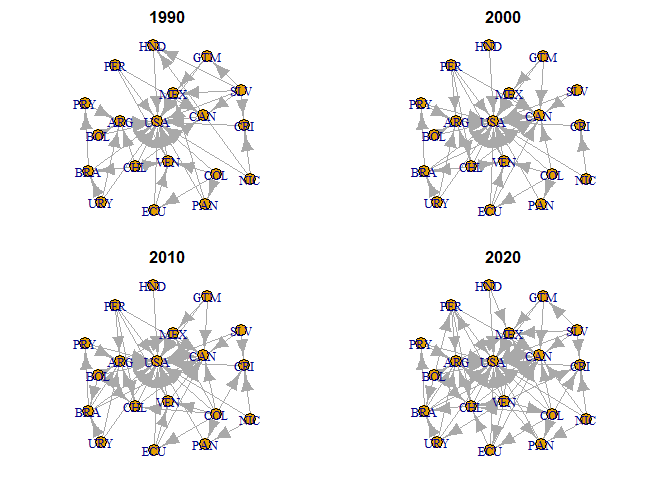
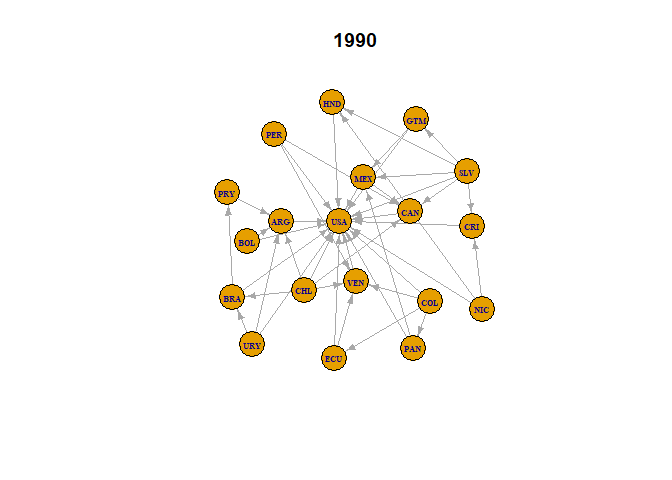

# Getting the Basic Network Visualizations
As indicated in the GitHub ReadMe for [Step 3: Constructing Network Objects](https://github.com/jthebl/MigrationAmericas_NetworkAnalysis/tree/ecf817a0bdcaef0eb92f9395bf40aef9e290f838/Immigration_Networks/Constructing_Networks), we will, in this R pub, demonstrate the visualization of the networks.


Let's start by visualzing a basic version of our networks. But first, it is essential that we establish a "standard format" for the networks; i.e. a structure in which the placement of the various vertices (countries) will remain the same across all networks (to ensure clarity in our later comparisons). We will do this by choosing any of the igraph objects, in this case the network associated with migration during 1990, and construct the network using the layout_with_fr() function. Further details on the various layout algorithms, in addition to many other relevant visualization functions can be found [here](https://kateto.net/networks-r-igraph/).

Now let's try visualing our networks using the simple plot() function


``` r
# Allow all four networks to be visualized together
  par(mfrow = c(2, 2), mar = c(1, 1, 2, 1))

# Now plot the networks
  plot(g_1990, 
       main = "1990",
       vertex.label = V(g_1990)$code,
       layout = layout_preferred)
  
  plot(g_2000, 
       main = "2000",
       vertex.label = V(g_2000)$code,
       layout = layout_preferred)
  
  plot(g_2010, 
       main = "2010",
       vertex.label = V(g_2010)$code,
       layout = layout_preferred)
  
  plot(g_2020, 
       main = "2020",
       vertex.label = V(g_2020)$code,
       layout = layout_preferred)
```

<!-- -->

This is certainly a rough-draft start, but here we can see how our network can be visualized. However, significant updates are needed to make these graphs more _comprehensible_. Let's start by adjusting the vertices, edges, and font sizes. Let's demonstrate with one of the figures, g_1990.


``` r
      plot(g_1990, #The graph object
           main = "1990", #The title we want to include
           layout = layout_preferred, #Setting the layout to our previously defined desired layout
           edge.arrow.size = 0.5, #Changing arrow/edge size
           vertex.size = 20, #Changes size of the vertex (yellow circle)
           vertex.label.font = 2, #Changing font type; here it is "Bolded"
           vertex.label.cex = .5, #Changing size of font (i.e. country code font)
           vertex.label = V(g_1990)$code) #Setting the vertex labels to the country code
```

<!-- -->

